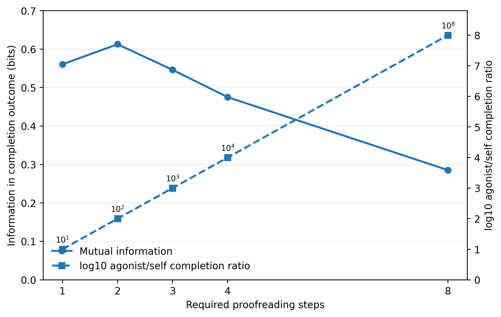

# T cell receptor proofreading

[Script and explanation](https://github.com/TaylorResearchLab/biological-information-limit-1/tree/main/examples/01_tcell_proofreading)

The CSV files retain full numerical precision. The previews below are rounded for reading.

## Table 1

[Full precision CSV](table_1_tcell_proofreading.csv)

| proofreading steps | agonist completion probability | agonist self completion ratio | equal prior classification error | mutual information bits |
| --- | --- | --- | --- | --- |
| 1 | 0.909 | 1e+01 | 0.091 | 0.561 |
| 2 | 0.826 | 1e+02 | 0.091 | 0.613 |
| 3 | 0.751 | 1e+03 | 0.125 | 0.546 |
| 4 | 0.683 | 1e+04 | 0.159 | 0.475 |
| 8 | 0.467 | 1e+08 | 0.267 | 0.285 |

## Supporting outputs

The figure reads the calculated CSV tables. `figure_data.json` records the plotted rows and their hashes.

[Parameters used](parameters_used.json) and [verification record](verification.json).

Other CSV and JSON files in this directory contain the accompanying calculations. The verification record identifies every source file checked and output produced.
