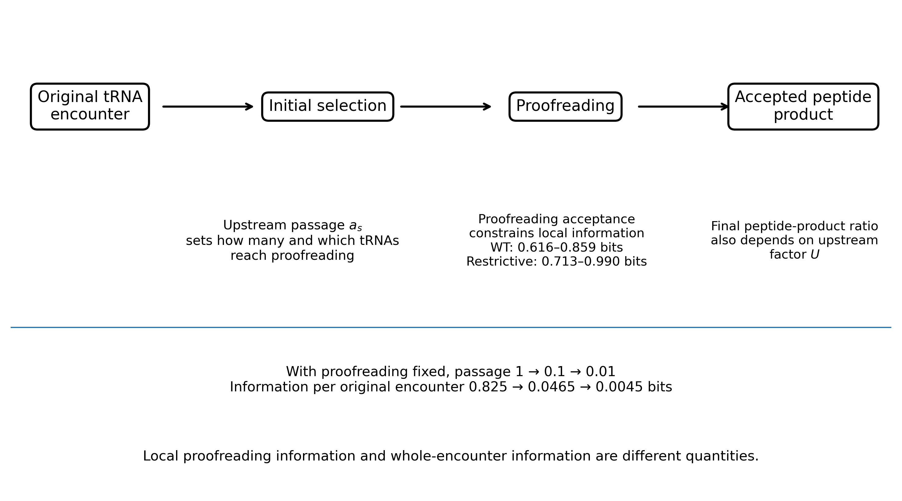

# Ribosomal tRNA selection

[Script and explanation](https://github.com/TaylorResearchLab/biological-information-limit-1/tree/main/examples/02_ribosome_selection)

The CSV files retain full numerical precision. The previews below are rounded for reading.

## Table 2

[Full precision CSV](table_2_ribosome_information.csv)

| ribosome preparation | near cognate input probability | cognate acceptance min | cognate acceptance max | near cognate acceptance min | near cognate acceptance max | information min bits | information max bits |
| --- | --- | --- | --- | --- | --- | --- | --- |
| wild_type | 0.500 | 0.900 | 1.000 | 0.048 | 0.052 | 0.616 | 0.859 |
| restrictive | 0.500 | 0.900 | 1.000 | 0.002 | 0.012 | 0.713 | 0.990 |

## Table 3

[Full precision CSV](table_3_ribosome_passage.csv)

| passage probability both classes | terminal information bits |
| --- | --- |
| 1.000 | 0.825 |
| 0.100 | 0.047 |
| 0.010 | 0.0045 |

## Supporting outputs

The figure reads the calculated CSV tables. `figure_data.json` records the plotted rows and their hashes.

[Parameters used](parameters_used.json) and [verification record](verification.json).

Other CSV and JSON files in this directory contain the accompanying calculations. The verification record identifies every source file checked and output produced.
