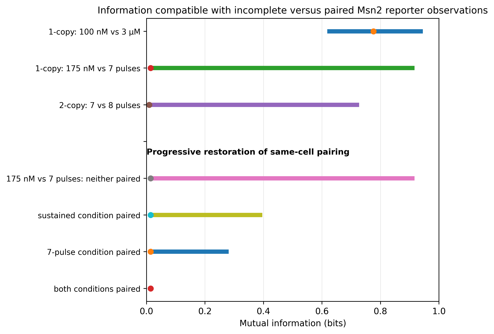

# Yeast Msn2 reporters

[Script and explanation](https://github.com/TaylorResearchLab/biological-information-limit-1/tree/main/examples/03_msn2_reporters)

The CSV files retain full numerical precision. The previews below are rounded for reading.

## Table 4

[Full precision CSV](table_4_msn2_information.csv)

| comparison | information min bits | information max bits | observed paired information bits |
| --- | --- | --- | --- |
| 1x / DM 70min 100nM / DM 70min 3uM | 0.618 | 0.944 | 0.776 |
| 1x / DM 70min 175nM / FM7 786minINT 690nM | 0.00898 | 0.916 | 0.014 |
| 2x / FM7 786minINT 690nM / FM8 625minINT 690nM | 0.00823 | 0.727 | 0.0092 |

## Table 5

[Full precision CSV](table_5_msn2_pairing.csv)

| pairing sustained retained | pairing pulsed retained | information min bits | information max bits |
| --- | --- | --- | --- |
| 0 | 0 | 0.00898 | 0.916 |
| 1 | 0 | 0.013 | 0.396 |
| 0 | 1 | 0.012 | 0.281 |
| 1 | 1 | 0.014 | 0.014 |

## Supporting outputs

The figure reads the calculated CSV tables. `figure_data.json` records the plotted rows and their hashes.

[Parameters used](parameters_used.json) and [verification record](verification.json).

Other CSV and JSON files in this directory contain the accompanying calculations. The verification record identifies every source file checked and output produced.
